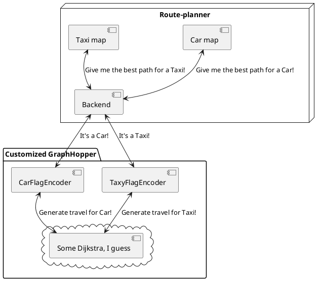

# Route-planner

Route planning with NodeJS web app.

## Technologies

NodeJS,
Express,
Nodemon,
Openlayers,
GraphHopper.

## Functioning

This web app has 2 maps, the first one displays the best route planning provided by GraphHopper in case of a car driver, the second one always displays the best route planning, but only after get the Taxi permissions (use of the bus lanes).

## Component diagram

